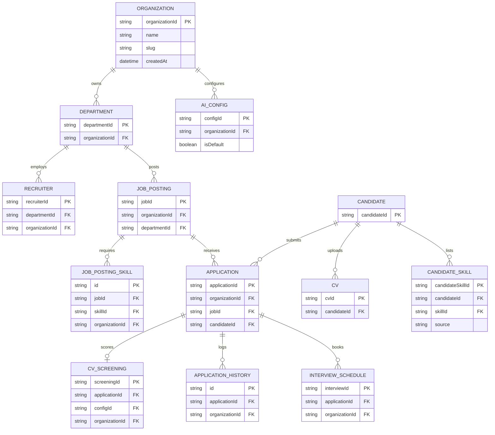

# Module spec — Multi-tenant row-level isolation

> Produced by `write-spec`. This file is **the SRS deliverable for ĐA2 GĐ1**: its Scope + Business
> rules + Acceptance criteria ARE the functional requirements the university report's SRS needs; the
> **UC list** below is derived directly from those criteria; the **ERD** is embedded as a mermaid
> diagram. All three of GĐ1's required documents (SRS/UC/ERD) live in this one file rather than three
> drifting copies. A later `build-feature` run implements this module and cites this file as the
> source of its own `spec.md`'s acceptance criteria.

**Date:** 2026-09-12 · **Module:** Multi-tenant row-level isolation · **Spec run:**
`multi-tenant-isolation`

## Observed on

| Surface | How accessed | By whom | When |
|---|---|---|---|
| ats-platform source (`apps/api`, `libs/backend/database`) — current single-tenant behaviour | `Read`/`Grep`, no live system running | This session's Explore agent + direct reads (see `survey.md`) | 2026-09-12 |

No live reference system exists for the module *being specified* — `Organization` has never been
implemented, so there is nothing to log into and observe. The reference is this same codebase's
**current** single-tenant behaviour, read from source (`survey.md`), not a live authenticated
walkthrough.

## Scope

This module introduces **`Organization`** as a tenant boundary sitting above the existing
`Department` hierarchy, and requires that every read and write of an org-scoped resource is confined
to the caller's own organization. **Org-scoped** (gain `organizationId`, 9 tables): `Department`,
`Recruiter`, `JobPosting`, `JobPostingSkill`, `Application`, `ApplicationHistory`, `CVScreening`,
`AiConfig`, `InterviewSchedule`. **Stay global / shared** (13 existing tables, unchanged): `User`,
`RefreshToken`, `Candidate`, `CV`, `CVParsedData`, `JobCategory`, `Skill`, `AiUsageLog`,
`InterviewTopic`, `InterviewSession`, `InterviewQnA`, `InterviewResult`, `Notification` — plus one
**new** global table, `CandidateSkill` (seeded now so GĐ3's RAG work does not force a later schema
change, per the project brain's GĐ3-ordering risk).

Candidates and their mock-interview activity form **one shared pool across all organizations** — a
job-board model, not per-org silos. An organization sees a candidate only through an `Application`
tied to that organization's own job posting; the same person applying to two organizations produces
one `Candidate`/`User` record and two independent, org-scoped `Application` rows.

Administration is **two-tier** in this build (Scope A, `decision.md` D1 — required by the approved
proposal, `research.md` #5):

- **`platform-admin`** — the existing global `admin`, unchanged: sees and administers every
  organization, plus the platform-wide taxonomies (`Skill`, `JobCategory`, `InterviewTopic`).
- **`org-admin`** — bound to exactly **one** organization; administers that organization's own
  departments, recruiters and `AiConfig`, and nothing outside it.

**How an `org-admin` is bound to its organization is deliberately not specified here** — three
workable shapes are weighed in `decision.md` D4 and left to `build-feature`. What this document does
fix is the behaviour every shape must satisfy: the binding resolves on every request, names exactly
one organization, and can never be self-elevated to another.

**Explicitly out of scope for this build:**
- The **enforcement mechanism** — a Prisma client extension, Postgres RLS, or the existing manual
  per-query pattern (`research.md` #1-2) — is `build-feature`'s choice when this module is
  implemented, not this document's.
- **How the caller's organization is threaded through a request** (AsyncLocalStorage, a JWT claim,
  or otherwise) — also `build-feature`'s.
- GĐ2+ features (bulk CV import, recruiter notes, evaluation forms), RAG (GĐ3), LiveKit (GĐ4),
  microservices extraction.
- **C-06/A-04** (the `getAllKanbanBoard` endpoint's dashboard/picker query cleanup) — deferred by the
  human's own earlier decision, unrelated to org-isolation itself.
- Reconciling the pre-existing `getMySchedules`-vs-`assertCanViewSchedule` boundary-width
  inconsistency on `InterviewSchedule` (`survey.md`) — not a cross-org concern.
- Resurrecting, wiring up, or deleting the dead `interview-schedule` case in `OwnershipGuard`
  (`survey.md`) — unreachable today, stays unreachable; touching it is unrelated scope creep.
- **How** the `org-admin` tier is stored and bound to its organization (a new role column, a flag on
  the recruiter record, or a join table) — the tier itself is **in** scope; only its storage shape is
  left to `build-feature` (`decision.md` D4).
- The code itself. This document is a specification.

## Constraints

| Constraint | Imposed by | Why it is not the implementer's choice |
|---|---|---|
| Candidate/User/CV/mock-interview activity stays one global, shared pool — never per-org silos | Human decision, this session (tenancy model) | Already chosen at a prior gate; re-siloing candidates would quietly reverse a decision the human explicitly made, not a free implementation detail |
| Administration is two-tier: a global `platform-admin` **and** a per-organization `org-admin` | The approved ĐA2 proposal, §3.b and §4 (`research.md` #5) — inside its official scope, not its optional extensions | Not a cost/benefit call the implementer may re-open: dropping the per-organization tier would put the delivered system out of line with what the supervisor signed off on 2026-08-24 |
| ADR 0002 (no AI auto-reject on score) must not be touched | `docs/architecture-decisions/0002-no-auto-reject-on-ai-score.md`; project brain §3 | A pre-existing, unrelated architectural decision this module must not disturb — GDPR Art. 22 human-in-the-loop spine |
| The 9 existing Department-based checks (`survey.md`) must keep working, org-scoping adds on top | `survey.md` | They are the model's only current authorization layer; org is a new boundary *above* Department, not a replacement for it |

**Technology named here is legitimate; technology named as a criterion is not.** No specific
technology is forced by this module beyond what is already the stack (Prisma/PostgreSQL) — the
enforcement mechanism itself is deliberately *not* constrained here (see Scope, "out of scope").

## Business rules

- Every org-scoped table's read and write is filtered to the caller's own organization; a caller
  with no organization (a bare `candidate`) never receives an org-scoped row directly — only via the
  Candidate/Application ownership path it already uses today.
- `Department` remains the isolation boundary **within** one organization, unchanged; `Organization`
  is a **new** boundary above it, never a replacement.
- A recruiter's organization is derived from `Recruiter.departmentId → Department.organizationId` —
  never stored redundantly in a way that could drift from the department record.
- The four gap surfaces found in `survey.md` (job-postings browse, recruiters directory, departments
  CRUD, the Socket.IO job-room join) gain the same organization check as everything else — they are
  not left as exceptions.
- ADR 0002's human-in-the-loop spine is unaffected: no AI output may auto-change
  `Application.status`, regardless of organization.
- `organizationId` is **denormalized directly onto every one of the 9 org-scoped tables**, including
  pure child tables (`JobPostingSkill`, `ApplicationHistory`, `CVScreening`, `InterviewSchedule`) —
  never derived only via a join through a parent. This is what keeps every one of the three
  enforcement mechanisms `research.md` documents equally viable, since a Postgres RLS policy in
  particular needs the column present on the table its own policy is attached to (`decision.md` D3).
- **`platform-admin`** is **not** filtered by organization for any org-scoped table — it keeps the
  global reach every current department-check already grants it (`survey.md`).
- **`org-admin`** *is* filtered, exactly like a recruiter, to its own organization — it is a wider
  role *within* one organization, never a way out of it. Its binding to that organization resolves on
  every request, names exactly one organization, and can never be self-elevated (`decision.md` D4).
- Extending this project's own `Admin ──▷ User` generalization (`research.md` #4), the tiers relate
  as **`platform-admin ──▷ org-admin ──▷ recruiter`**: each inherits the one below it, and only the
  outermost one crosses the organization boundary.

## Acceptance criteria — «When … then …»

| # | Criterion | Cites |
|---|---|---|
| 1 | When a recruiter authenticated under Organization A calls any list/search endpoint for applications, candidates (via their application scope), job postings, or recruiters, then only rows belonging to Organization A are returned — never a row belonging to another organization. | `survey.md` (`assertCanAccessDepartment`, `getRecruiterCandidateScope`, the job-postings/recruiters gap findings) |
| 2 | When a recruiter authenticated under Organization A requests a specific resource by id that belongs to Organization B (a job posting, an application, an interview schedule, a CV screening, a department), OR attempts to join that resource's Socket.IO job room, then the request is refused (403/404 for REST; the join is denied for the socket) — regardless of id-space overlap between organizations. | `survey.md` (`OwnershipGuard`, `canJoinJobRoom`) |
| 3 | When a candidate applies to a job posting owned by Organization A and, separately, to a job posting owned by Organization B, then exactly one `Candidate`/`User` record exists for that person, and each `Application` is scoped to its own organization — Organization A never sees the Organization B application or vice versa. | Tenancy model decision, this session · `survey.md` (Candidate/Application schema) |
| 4 | When the multi-tenant migration runs against the existing single-tenant database, then every existing row across the 9 org-scoped tables is assigned to exactly one backfilled ("seed") organization, and no row is left with a null `organizationId` afterward. | The C-03/C-04 data-preserving backfill technique, already proven twice on this codebase this session · `ASSUMPTION` (the seed organization's own field values are this document's proposal — see ERD — not yet human-confirmed at the field level) |
| 5 | When any `AiConfig` row is read or written by a recruiter/admin, then only the row(s) belonging to the caller's own organization are visible or mutable — the platform no longer has one implicit global default screening configuration shared by every organization. | `survey.md` (`AiConfig` schema, no current org concept) · `decision.md`-adjacent settled rationale (`plan.md`, "AiConfig → per-org") |
| 6a | When a **`platform-admin`** calls any list/search endpoint that is organization-scoped for a recruiter, then rows from **every** organization are returned — the global reach every current department-check already grants an admin (`survey.md`) is unchanged by this module. | `survey.md` (every enforcement site's admin bypass) · `research.md` #4 (`Admin ──▷ User` generalization this module extends into a three-tier one) |
| 6b | When an **`org-admin`** calls the same endpoints, then only rows belonging to **its own** organization are returned — the same boundary a recruiter gets, not the platform-admin's. An `org-admin` requesting a resource, or acting on a department/recruiter/`AiConfig`, outside its own organization is refused exactly as criterion 2. | `research.md` #5 (the proposal's *"quản trị viên của mỗi doanh nghiệp"* administers that enterprise, not others) · `decision.md` D1 |
| 7 | When a `Department` is created (the existing `Manage Department` use case, full CRUD — `research.md` #4), then its owning `Organization` is determined by **who is creating it**: for an `org-admin`, it is that admin's own bound organization and may not be overridden to another; for a `platform-admin`, who belongs to no organization, it must be supplied **explicitly** in the request — it cannot be inferred the way a recruiter's organization is inferred from `Recruiter.departmentId`. | `survey.md` (`departments.service.ts` has zero scoping today) · `apps/api/src/app/job-postings/job-postings.service.ts:69-76` (verified this session — the codebase's only existing "derive the org" pattern requires the caller to already be a `Recruiter`, which neither admin tier is) · `decision.md` D4 |

## Edge cases

| # | Edge case | Expected | Cites |
|---|---|---|---|
| E1 | A recruiter enumerates an id for a resource in another organization on one of the three previously **unscoped** REST surfaces (job-postings browse, recruiters directory, departments CRUD). | Refused exactly as criterion 2 — these three surfaces gain the same organization check as everything else; they are not left as an exception just because they had no department check before. | `survey.md` (gap surfaces), `decision.md` D2 |
| E2 | A `Recruiter`'s `Department` has no resolvable `Organization` — a mid-migration state or a data-integrity break in the `Department → Organization` link. | The recruiter is treated as having **zero** organization-scoped access (fail closed), never falls back to "sees everything" and never crashes the request. | `ASSUMPTION` — no current code path allows a recruiter with no department (`Recruiter.departmentId` is non-null, `survey.md`), but the analogous `Department`-with-no-`Organization` case is new to this module and its failure direction must be specified, not left implicit |
| E3 | The dead `interview-schedule` case in `OwnershipGuard` (unreachable today — no controller applies it). | Left as-is. Not resurrected, wired up, or deleted by this module — doing either is unrelated scope creep with no isolation-correctness value. | `survey.md` |
| E4 | A `Notification` references an org-scoped entity (e.g. `relatedEntityType: application`) and is read by its owning user. | No organization check is required — every notification list/read is already filtered to the caller's own `userId`, never listed across users, and this module does not change `Notification` into an org-scoped table. | `research.md` #3 (verified) |

## Embedded ERD (`ASSUMPTION` — proposed schema, not yet field-confirmed by the human)

The relationships (which table gains `organizationId`, and via which parent) are grounded in
`survey.md`'s schema read. `Organization`'s own field list below is this document's design proposal.
**Scope of this diagram:** every org-scoped table (all 9) plus the global tables directly on the
tenant boundary's seam (`Candidate`, `CV`, and the new `CandidateSkill`) are drawn in full, each with
a filled attribute block — this is deliberately *not* a redraw of the whole 23-table schema. Of the
13 existing global tables, only `Candidate` and `CV` sit on that seam and are drawn; the other 11
(`User`, `RefreshToken`, `CVParsedData`, `JobCategory`, `Skill`, `AiUsageLog`, the four
mock-interview tables, `Notification`) are out of frame because they carry no `organizationId`, are
not directly reachable from an org-scoped row, and this module changes nothing about them.

**Read this diagram's seam deliberately:** `CANDIDATE`, `CV`, and `CANDIDATE_SKILL` carry **no**
`organizationId` — they sit entirely outside the tenant boundary, connecting *into* org-scoped
`APPLICATION` rows, one per organization applied to. That is the shared-pool model stated in Scope,
drawn rather than only described. Every org-scoped entity here (including the pure child tables
`JOB_POSTING_SKILL`, `APPLICATION_HISTORY`, `CV_SCREENING`, `INTERVIEW_SCHEDULE`) carries its own
`organizationId FK` rather than relying on a join through its parent — see `decision.md` D3 for why
that denormalization was chosen over the alternative, and the drift risk it does not close.

**One relationship is deliberately absent from this diagram:** how an **`org-admin`** is bound to its
`Organization`. Scope A requires the tier to exist, but three workable storage shapes are still open
(`decision.md` D4) and drawing one here would pin a choice this document said it would leave to
`build-feature`. The ERD is therefore complete for the data model and **incomplete on exactly that
one edge**, which is stated rather than quietly omitted.

## UC — extends this project's own existing Use Case inventory, not a parallel one

`important-notes/mo_ta_use_case_ATS.md` (`research.md` #4) is this project's established Use Case
documentation from ĐA1, using `<<extend>>`/`<<include>>`/generalization relationships as its own
convention for an optional or constrained variant of an existing use case. Most of this module's
new behaviour is exactly that kind of variant — **it extends an existing use case, it does not
duplicate it under a new name.**

**Generalization (reusing the project's own `Admin ──▷ User` pattern, line 49-50 of that document):**
`platform-admin ──▷ org-admin ──▷ Recruiter` — each tier inherits the use cases of the one below it;
`org-admin` adds its organization's department/recruiter/`AiConfig` administration while staying
*inside* the organization boundary (criterion 6b), and only `platform-admin` crosses it (criterion
6a).

| Relationship | Existing use case extended | What this module adds | Actor | Criterion |
|---|---|---|---|---|
| `<<extend>>` | `Manage Job Postings`, `View Candidates` (§3 HR Operations, `research.md` #4) | Listing is scoped to the caller's own organization; an id/socket-room outside it is refused | Recruiter | 1, 2 |
| `<<extend>>` | `Apply` (§6 Candidate Experience, `research.md` #4) | Optional variant: the job posting applied to may belong to a different organization than a previous application — still one `Candidate` record | Candidate | 3 |
| `<<extend>>` | `Adjust AI Screening Criteria` (§2 Authentication and Administration, `research.md` #4) | Optional variant: the criteria being adjusted belong to the caller's own organization only | Recruiter / Admin | 5 |
| `<<extend>>` | `Manage Department` (§2, full CRUD, `research.md` #4) | Owning organization comes from the `org-admin`'s own binding, or must be supplied explicitly by a `platform-admin` | org-admin / platform-admin | 7 |
| `<<extend>>` | `Manage User`, `Manage Department`, `Setup Configuration` / `Adjust AI Screening Criteria` (§2, `research.md` #4) | These admin use cases gain a second, narrower actor: an `org-admin` may perform them **only within its own organization** | org-admin (**new actor**) | 6b |
| Generalization | `platform-admin ──▷ org-admin ──▷ Recruiter` (new, this module — see above) | Only the outermost tier crosses the organization boundary | platform-admin / org-admin | 6a, 6b |
| **New use case** — no existing analog (`research.md` #4 found none) | — | Run the tenant migration so every existing row lands in exactly one organization | Ops/Admin (**new actor** — not previously modeled anywhere in the project's UC documentation) | 4 |

**Open question this raises, left for the human rather than decided here:** the migration row above
is the *only* genuinely new use case, and it is an operational/deployment action, not something an
end user does through the product's UI — this project's UC documentation has never modeled an
"Ops" actor or a deployment-time action as a use case at all. Whether it belongs in a formal UC
diagram, or is better recorded as a deployment runbook step outside the UC inventory, is a
documentation-convention call this spec does not make unilaterally.

## Provenance markers used above

- **Observed §N** — a live system was watched directly and reported back, by the person named in the
  table above. `write-spec` cannot itself reach an authenticated live system, so this marker is
  honest about *who* saw it: it is not `rules/evidence-policy.md`'s `verified`, which means run *by
  the workflow, here*. A human's own walkthrough is real evidence, but not evidence the harness
  produced — say which one this is.
- **research.md #N** — `documented` or `verified` per `rules/evidence-policy.md`, cited by number
  from this task's `research.md`.
- **ASSUMPTION** — neither of the above. Carried into `plan.md`'s open items; a criterion resting
  only on an assumption is a finding to surface at `write-spec`'s plan-approval gate, never a silent
  pass.

## Cross-module contract notes

A future `build-feature` run implementing this module must **not** change any REST response shape a
frontend already consumes for these entities — `organizationId` becomes an internal filter, never a
new required field in a DTO returned to the client (the caller already knows their own organization
implicitly; it does not need it echoed back). Any endpoint that currently returns a resource without
a department check (the 3 gap surfaces in `survey.md`) will start returning **fewer** rows once this
module ships — this is a real behaviour narrowing, and any web consumer of
`job-postings.service.ts#findAll`, `recruiters.service.ts#findAll`, or the Socket.IO `job_<jobId>`
room must be re-checked against it rather than assumed unaffected.
